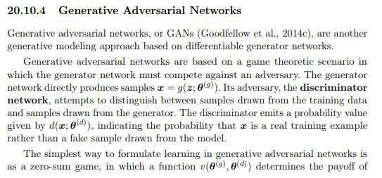
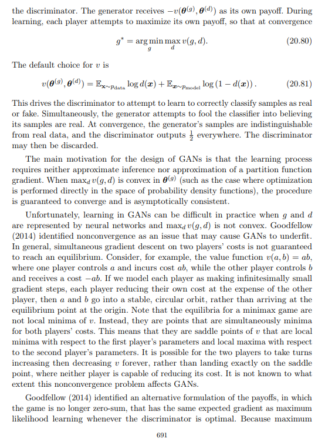
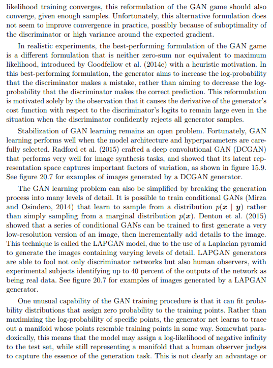
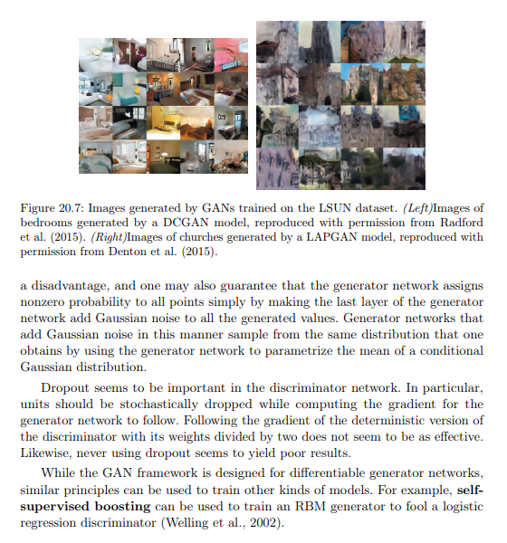

### Resumo:

### Referências:

- https://www.youtube.com/watch?v=Wi4jBUjwMYM
- https://www.youtube.com/watch?v=y_DoVYAOTzA
- https://www.geeksforgeeks.org/deep-learning/generative-adversarial-network-gan/
- https://www.ibm.com/think/topics/generative-adversarial-networks
- https://jonathan-hui.medium.com/gan-whats-generative-adversarial-networks-and-its-application-f39ed278ef09
- https://medium.com/@davialves.war/como-funciona-uma-gan-42d5bb4243ff
- https://developers.google.com/machine-learning/gan/gan_structure?hl=pt-br
- https://machinelearningmastery.com/what-are-generative-adversarial-networks-gans/
- https://www.servicenow.com/ai/what-are-generative-adversarial-networks.html
- https://aws.amazon.com/pt/what-is/gan/
- https://medium.com/@gabrielequevedo/redes-adverstivas-generativas-gans-3828a4099569
- https://www.dhiwise.com/post/best-applications-of-generative-adversarial-networks
- https://www.venturus.org.br/insights/blog/o-que-sao-gans
- https://didatica.tech/introducao-a-gans-redes-adversarias-generativas/s
- https://www.linkedin.com/advice/1/what-benefits-limitations-using-gans-machine-learning?lang=pt&originalSubdomain=pt

### Deep Learning - Yoshua Bengio

